# Predictive Coding

A third-party reimplementation of the paper: ["Predictive Coding in the Visual Cortex: a Functional Interpretation of Some Extra-classical Receptive-field Effects"](https://www.researchgate.net/publication/13103385_Predictive_Coding_in_the_Visual_Cortex_a_Functional_Interpretation_of_Some_Extra-classical_Receptive-field_Effects) by Rajesh P. N. Rao and Dana H. Ballard

## Network

Network image from Rao's original paper:
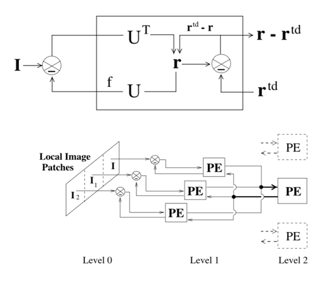

## Results

### Network weights

#### Level1

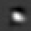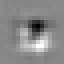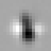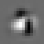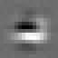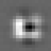

#### Level2
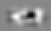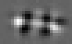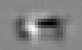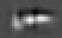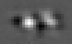

### End stopping

Visualization of the prediction errors (r - r^td) at the center level1 module with long and short bar image input.

The prediction errors for the long bar should be much more smaller, they are not smaller compared with the original paper's result.

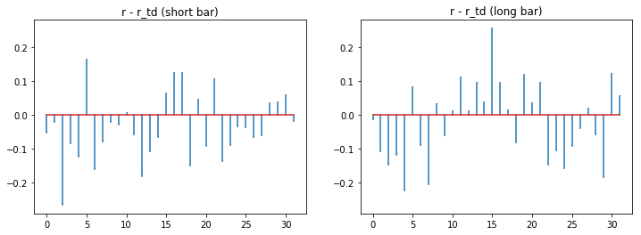

